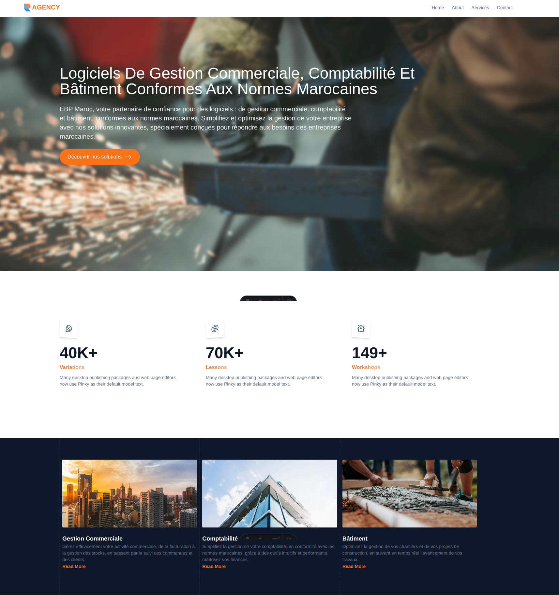

### Web Agency Website



### Description
 Is a website for a web agency that offers services such as web design, web development, and digital marketing. The website is designed to be responsive and accessible on all devices. The website is built using Astro and Tailwind CSS and Alpine.js.

### Features
- Responsive design
- Accessible on all devices
- Web design
- Web development
- Digital marketing

### Technologies

- Astro
- Tailwind CSS
- Alpine.js

### Installation

1. Clone the repository
```bash
git clone https://github.com/redaezziani/web-agency
```

2. Install dependencies
```bash
cd web-agency
npm install
```

3. Start the development server
```bash
npm run dev
```

4. Build the website
```bash
npm run build
```

### License
This project is open source and available under the [MIT License](LICENSE).

### Author
- [Reda Ezziani](https://github.com/redaezziani "Reda Ezziani")
- [Email](mailto:redaezziani.dev@gmail.com")

### Badges :


